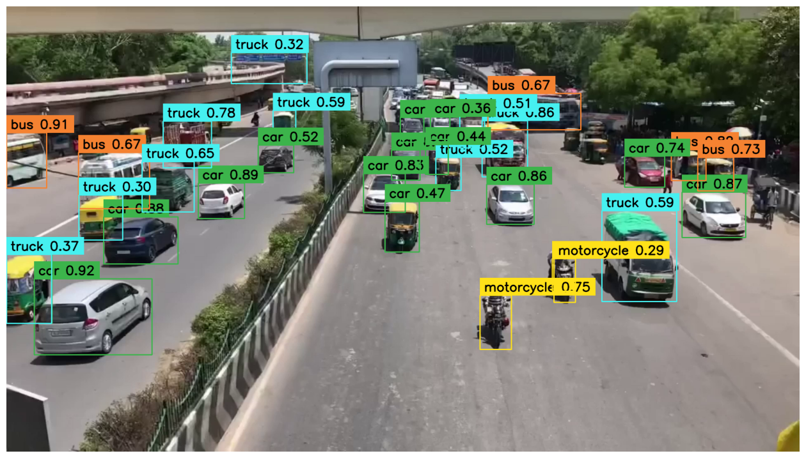
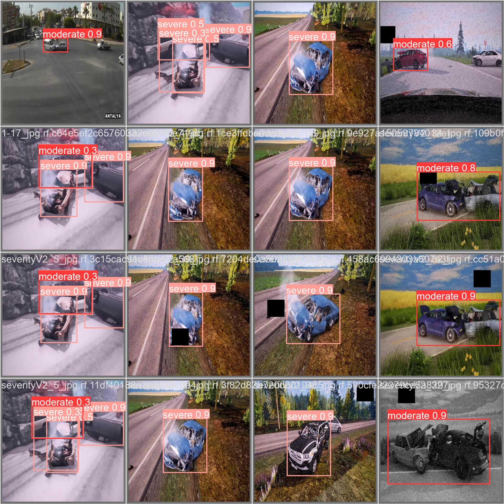
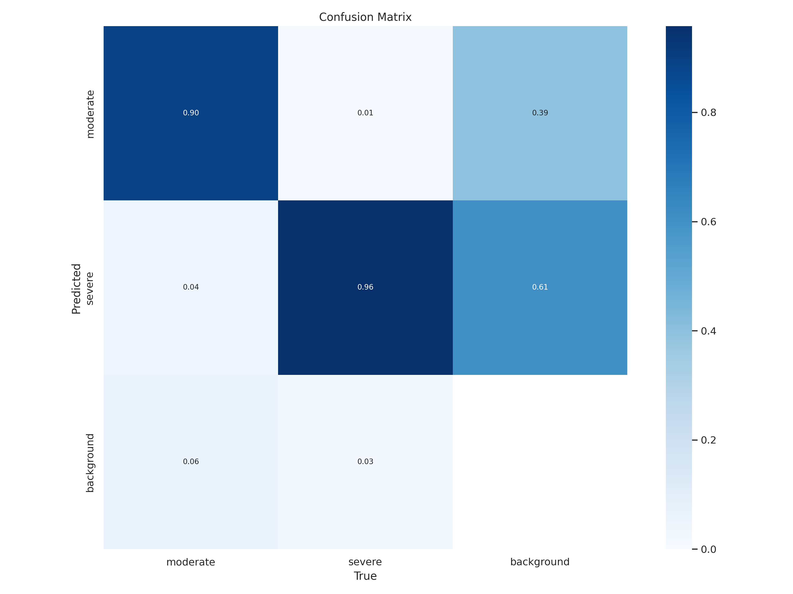
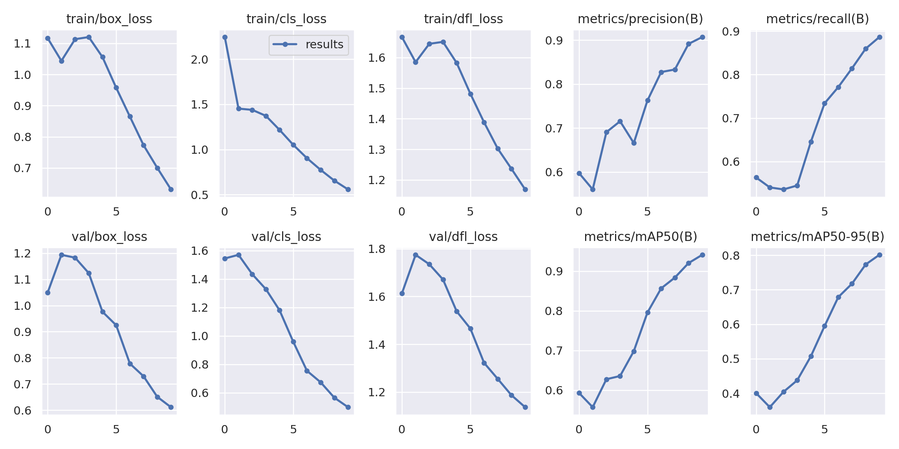

# 🚦 CDTARS – Collision Detection & Traffic Analysis in Real-Time Systems

**CDTARS** is an advanced road safety and traffic intelligence system that leverages **YOLOv8**, custom-trained models, and real-time video analytics to detect vehicles, track movement, and identify road accidents.

It is designed to enhance **traffic monitoring**, **accident prevention**, and **emergency response systems**, contributing toward smarter and safer transportation infrastructure.

---

## 📌 Features

- 🚗 Real-Time Vehicle Detection  
- 🧠 Custom Accident Detection Model  
- 🎯 High-Accuracy YOLOv8 Object Detection  
- 📍 Vehicle Tracking with ByteTrack  
- 📊 Traffic Flow Analysis  
- ⚠️ Abnormal Event Recognition (Accidents)  
- 🎥 Video Processing & Annotation  
- ⚡ GPU-Accelerated Inference  

---

## 🏗️ System Architecture

```
Input Video → YOLOv8 Detection → Object Tracking → 
Event Analysis → Accident Detection → Output Video + Insights
```

---

## ⚙️ Installation

### 1. Clone Repository
```bash
git clone https://github.com/your-username/CDTARS.git
cd CDTARS
```

### 2. Install Dependencies
```bash
pip install ultralytics supervision gdown
```

### 3. Verify GPU (Optional)
```bash
nvidia-smi
```

---

## 🚗 Vehicle Detection Module

### Load Pre-trained YOLOv8 Model
```python
from ultralytics import YOLO

model = YOLO("yolov8x.pt")
model.fuse()
```

### Supported Classes
- Car  
- Motorcycle  
- Bus  
- Truck  

---

### 📸 Single Frame Detection

```python
results = model(frame)[0]
detections = sv.Detections.from_ultralytics(results)
```

- Annotates bounding boxes  
- Displays class labels with confidence scores  

---

### 🎥 Full Video Processing

- Uses **ByteTrack** for tracking  
- Line crossing detection  
- Object trace visualization  

```python
byte_tracker = sv.ByteTrack()
sv.process_video(...)
```

#### Output:
- Annotated video  
- Vehicle counts  
- Movement traces  

---

## 🚨 Accident Detection Module

### Custom Model Training

- Dataset sourced from **Roboflow**  
- Fine-tuned YOLOv8 model (`best.pt`)  

### Load Custom Model
```python
from ultralytics import YOLO

model = YOLO("/content/best.pt")
model.fuse()
```

### Capabilities

- Detects accident scenarios  
- Identifies abnormal vehicle behavior  
- Enables real-time alerts  

---

## 📊 Technologies Used

| Technology   | Purpose                  |
|-------------|-------------------------|
| YOLOv8      | Object Detection        |
| Supervision | Annotation & Tracking   |
| ByteTrack   | Multi-object Tracking   |
| Roboflow    | Dataset Management      |
| Python      | Core Development        |
| OpenCV      | Video Processing        |

---

## 🚀 Use Cases

- Smart City Traffic Management  
- Highway Surveillance Systems  
- Accident Detection & Alert Systems  
- Autonomous Traffic Monitoring  
- Emergency Response Optimization  

---

## ⚡ Challenges Addressed

- Limited labeled accident datasets  
- Real-time processing constraints  
- Multi-object tracking accuracy  
- GPU resource optimization  

---

## 🔮 Future Improvements

- Integration with **5G / V2X communication**  
- Deployment on **edge devices (Jetson, Raspberry Pi)**  
- Reinforcement Learning for adaptive traffic control  
- Cloud-based analytics dashboard  
- Multi-camera fusion system  

---

## 📈 Impact

CDTARS aims to:

- Reduce road accidents 🚫  
- Improve traffic efficiency 🚦  
- Enable faster emergency response 🚑  
- Support smart infrastructure development 🌐  

---

## 🎥 Demo  

### Sample Frame with Bounding Boxes:  



---

## ⚙️ Installation  

Clone the repository and install dependencies:  

```bash
git clone https://github.com/yourusername/vehicle-detection.git
cd vehicle-detection
pip install -r requirements.txt
```

---

## 🚀 Usage  

Run the Jupyter Notebook:  

```bash
jupyter notebook CDTARS.ipynb
```

Or directly run the script (if available):  

```bash
python detect.py --input sample_video.mp4
```

---

## 📊 Results & Visualization  

Vehicle counts over time:  

 

Detection confidence graph:  




---

## 🤝 Contributing

Contributions are welcome!

```bash
fork → create branch → commit → pull request
```

---

## 📜 License

This project is licensed under the **MIT License**.

---

## 👨‍💻 Author

**Amit Bhardwaj**  
B.Tech CSE | Traffic AI Researcher  
